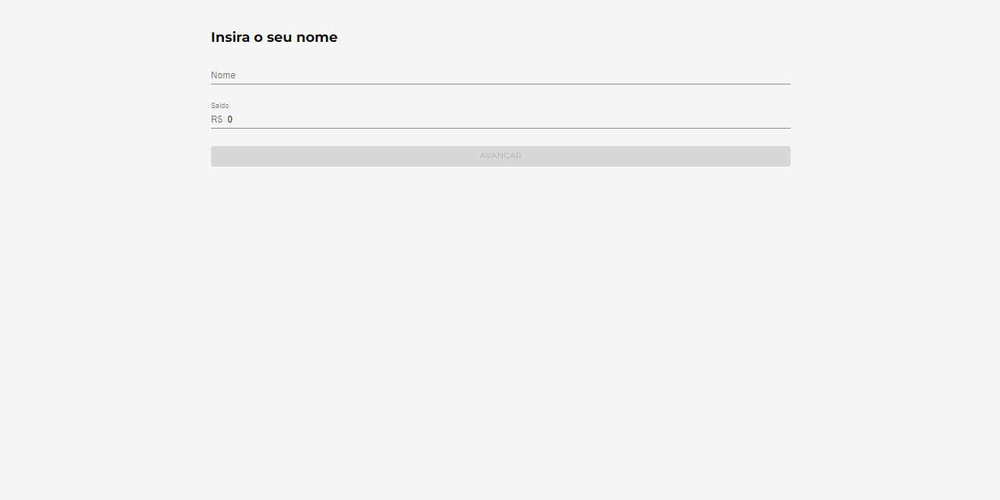
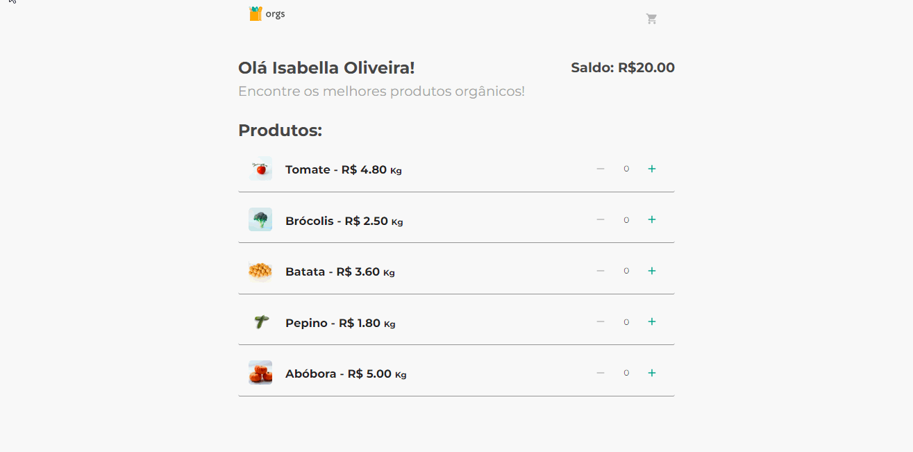
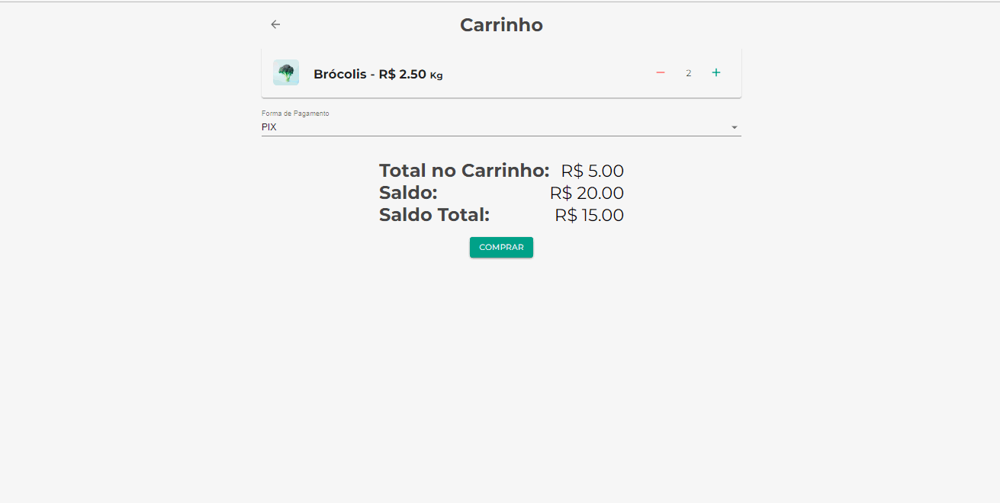
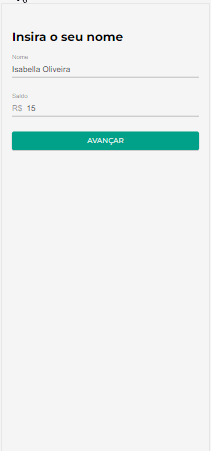

# CARRINHO DE FEIRA 

Esse projeto foi desenvolvido em React com Javascript. Ele simula um carrinho de feira virtual onde o usuario pode adicionar 
produtos ao carrinho e finalizar sua compra de acordo com seu saldo disponivel.  

## Tela Inicial

Nessa tela, o usuario digita o seu nome e o saldo que possui em sua conta. Se as informacoes forem validas, o botao é
habilitado e ele é encaminhado para a proxima pagina. 

### WEB 

## Tela de Produtos 

Aqui o usuario pode adicionar a quantidade de produtos que deseja, em seu carrinho. 

### WEB 

## Tela de Finalizar Compra 

Nessa tela o usuario seleciona a opcao de pagamento que deseja, dependendo de qual for ele pode obter desconto na sua compra. 
Ao finalizar a compra o valor é descontado da sua conta. 

### WEB 

### MOBILE 
